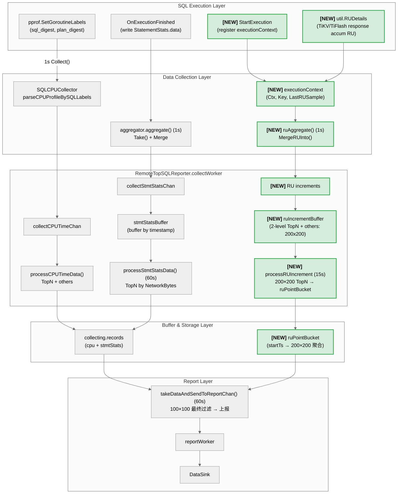

# TiDB TopRU 设计

- Author: [zimulala](https://github.com/zimulala)
- Tracking Issue: https://github.com/pingcap/tidb/issues/65471

## Table of Contents

* [Introduction](#introduction)
  * [Background](#background)
  * [Goals](#goals)
  * [Non-Goals](#non-goals)
* [Detailed Design](#detailed-design)
  * [Architecture Overview](#architecture-overview)
  * [功能与语义定义](#功能与语义定义)
    * [TopRU 定义](#topru-定义)
    * [功能开关](#功能开关)
  * [数据采集机制](#数据采集机制)
  * [数据模型与存储](#数据模型与存储)
  * [性能与风险分析](#性能与风险分析)
  * [与其他可观测性模块联动](#与其他可观测性模块联动)
* [Limitation](#limitation)
* [Compatibility Issues](#compatibility-issues)
  * [Functional Compatibility](#functional-compatibility)
  * [Upgrade Compatibility](#upgrade-compatibility)
* [Test Design](#test-design)
* [Impact & Risk](#impact--risk)
* [Investigation & Alternatives](#investigation--alternatives)

## Introduction

### Background

Next-gen TiDB Cloud 按 RU（Request Unit）计费。当集群 RU 消耗异常或达到限制时，用户需要快速定位高 RU 消耗的 SQL，但目前缺乏有效手段近实时识别 RU 消耗的主要 SQL。

**典型场景**：当集群达到 MAX RCU 限制并触发告警时，用户需要快速定位高 RU 消耗的 SQL，以便执行 Terminate 或优化操作，解除资源压力并恢复服务。

**现有方案的局限**：

| 方案 | 局限性 |
|------|--------|
| 慢日志 (Slow Log) | 仅记录已完成的慢查询，无法反映执行中 SQL 的 RU 消耗 |
| Statement Summary | 默认 30 分钟持久化，无法访问内存中的实时数据，不满足分钟级实时需求 |

**TopRU** 通过复用 TopSQL 基础设施，提供按 RU 消耗排序的近实时可观测能力，弥补上述不足。

### Goals

1. **按 RU 消耗排序**：支持按累计 RU 消耗进行排序和查询，识别高 RU SQL（包括执行时间短但 RU 消耗大的 SQL）
2. **用户维度聚合**：按 `(user, sql_digest, plan_digest)` 三元组维度聚合，支持按用户查看 RU 消耗分布
3. **近实时统计与（下游）历史查询**：
   - 本地 1 秒采样，支持执行中 SQL 的 RU 统计
   - 每 `report_interval`（默认 60s）批量上报至下游组件（如 VM），由其写入可观测系统的存储层
   - TiDB 侧仅负责采集与上报；历史查询能力由下游可观测系统提供（例如查询最近时间段的 RU 消耗数据）
4. **"近实时"延迟范围定义（端到端）**：
   - 本地采样写入内存 buffer：<= 1s（一个采样周期内）
   - 可观测系统可见性（用户侧）：约 `report_interval（默认 60s）+ 下游写入/查询延迟`，通常为 60~120s
5. **兼容现有能力**：与 TopSQL 现有的 CPU 时间统计功能并存，互不影响

### Non-Goals

1. **TopRU RU ≠ Billing RU**: TopRU 展示的 RU 来自 `util.RUDetails` 运行时观测口径，适合用于定位高消耗 SQL；计费与对账仍以 Billing RU 为准，本期不做对齐工作
2. **执行中 SQL 完整信息情况**: 执行中 SQL 即使已消耗大量 RU，也可能因 SQL 尚未完成而无法获取完整的 slow query / SQL statement 相关信息
3. **异常检测与自动告警**: 自动检测 RU 消耗异常并生成告警的功能本期不做支持

## Detailed Design

### Architecture Overview

TopRU 采用**三层缓冲架构**，复用 TopSQL 的采集和上报链路，在保证近实时性的同时控制内存开销。

**架构图**（`[NEW]` 标记为 TopRU 新增链路）：

```
+-------------------------------------------------------------------------------------------+
|                                   SQL Execution Layer                                     |
|  +------------------------------------+    +-------------------------------+              |
|  | pprof.SetGoroutineLabels()         |    | OnExecutionFinished           |              |
|  | (sql_digest, plan_digest label)    |    | (write StatementStats.data)   |              |
|  +-------------------+----------------+    +---------------+---------------+              |
|                      |                                     |                              |
|  [NEW] +-------------+-------------+    +------------------+-----------------+ [NEW]      |
||        | StartExecution             |    | util.RUDetails                   |             |
||        | (register executionContext)|    | (TiKV/TiFlash response accum RU) |             |
|        +-------------+--------------+    +------------------+----------------+             |
+----------------------|-------------------------------------|----------------|-------------+
                       | (CPU Time)          (StmtStats)     |  [NEW] (RU)    |
                       v                          |          v                v
+-------------------------------------------------------------------------------------------+
|                                   Data Collection Layer                                   |
|                                                                                           |
|  +----------------------------------+    +----------------------------------+             |
|  | SQLCPUCollector                  |    | StatementStats.data              |             |
|  | - profileConsumer recv profile   |    | map[SQLPlanDigest]*Item          |             |
|  | - parseCPUProfileBySQLLabels()   |    | - ExecCount, Duration            |             |
|  | - parse pprof label get CPU Time |    | - NetworkBytes, KvStats          |             |
|  +----------------+-----------------+    +----------------+-----------------+             |
|                   |                                       |                               |
||  [NEW] +----------+---------------------------------------------------+ [NEW]            |
|||        | StatementStats.execCtx + finishedRUIncrements             |                   |
|||        | (Ctx, Key(user+sql+plan), LastRUSample)                        |                   |
||        +------------------------------+-------------------------------+                   |
||                                       |                                                   |
||                   v                   v                   v [NEW]                         |
|||        Collect() per 1s    aggregator.aggregate()    ruAggregate() per 1s                 |
|||                   |          per 1s Take()+Merge     MergeRUInto()                        |
+-------------------|---------------------------|-------------------|------------------------+
                    |                           |                   |
                    v                           v                   v
+-------------------------------------------------------------------------------------------+
|                            RemoteTopSQLReporter.collectWorker                             |
|                                                                                           |
|  collectCPUTimeChan      collectStmtStatsChan          [NEW] collectRUIncrementsChan      |
|        |                          |                                |                      |
|        v                          v                                v                      |
||  processCPUTimeData()       stmtStatsBuffer              ruIncrementBuffer [NEW]          |
||  - TopN filter              (buffer by ts)               (2-level TopN + others:          |
||  - evicted -> others              |                       200 users x 200 SQLs)           |
|        |                          v (60s)                          |                      |
|        |                    processStmtStatsData()                 v (15s) [NEW]          |
|        |                    - TopN by NetworkBytes           processRUIncrementBuffer()   |
|        |                    - merge to records               - 200×200 TopN → ruPointBucket|
|        v                          |                                |                      |
|  +-----------------------------+--+------------------------------------+ [NEW]            |
|  | collecting.records          |  ruPointBucket                       |                   |
|  | (key: sql+plan)             |  (startTs → 200×200 聚合)            |                   |
|  +-----------------------------+--------------------------------------+                   |
+--------------------------------------+----------------------------------------------------+
                                       | per 60s reportTicker
                                       v
+-------------------------------------------------------------------------------------------+
|                                      Report Layer                                         |
|  +-------------------------------------------------------------------------------------+  |
|  | takeDataAndSendToReportChan()                                                       |  |
|  | - getReportRecords(): sort by totalCPUTimeMs, take TopN                             |  |
|  | - [NEW] getRUReportRecords(): finalize point bucket (100x100), build RURecords      |
|  | -> reportCollectedDataChan -> reportWorker -> DataSink                              |  |
|  +-------------------------------------------------------------------------------------+  |
+-------------------------------------------------------------------------------------------+
```

**Mermaid 版**（淡绿色背景为 TopRU 新增链路）：



**设计原则**：

| 原则 | 说明 |
|------|------|
| 复用基础设施 | 采集点接口、上报链路均复用 TopSQL 现有实现 |
| 前置过滤 | 1s 采集时即做两级 TopN 限制（Top 200 users × per-user Top 200 SQLs）+ others 汇总，避免 buffer 膨胀 |
| 分层存储 | 1s 按秒存储 (200×200) → 15s 按区间合并 (200×200) → 60s 合并上报 (100×100) |
| 分离存储 | CPU 数据用 `collecting.records`，RU 数据用 `collecting.ruRecords`，互不影响 |
| 内存可控 | 两级 TopN + others 汇总 + 硬上限保护 |

**核心数据流**：

```
SQL 执行 → ExecutionContext 注册 → 1s 采样写入 ruIncrementBuffer[ts]（200×200 前置过滤）
                                           ↓ (15s) drain + 合并到 ruPointBucket[startTs]
                                           ↓ (60s) 合并 4 个 15s 区间 + 100×100 最终过滤 → 上报
```

### 功能与语义定义

#### TopRU 定义

**TopRU** 是 TiDB 提供的按 RU 消耗排序和查询 SQL 的可观测性功能，支持按用户维度聚合，帮助用户快速定位高 RU 消耗的 SQL。

**RU 计算**: `TotalRU = RRU + WRU`，通过 `util.RUDetails` 的 `RRU()` 和 `WRU()` 方法获取。RU 来源包括 TiKV 和 TiFlash 的响应。

**RUDetails 语义说明**：
- `util.RUDetails` 是运行时**累加型**指标：在 SQL 执行过程中，TiDB 在处理 TiKV/TiFlash 响应时持续将每次请求的 RU 消耗增量累加到 `RUDetails`。
- 因此采样时读取到的是“截至当前时刻的累计值”，TopRU 通过 `ruDelta = currentRU - lastRU` 计算采样周期内的 RU 增量，避免重复计数。

**聚合维度**: `(user, sql_digest, plan_digest)` 三元组
- `user`: 从 `SessionVars.User.Username` 获取
- `sql_digest`: SQL Digest，标识 SQL 语句模式
- `plan_digest`: Plan Digest，标识执行计划

#### 功能开关

TopRU 通过**订阅端配置**控制（Agent 下发给 TiDB）：

| 配置项 | 类型 | 默认值 | 说明 |
|--------|------|--------|------|
| `enable_top_ru` | bool | false | TopRU 开关，控制采集与上报 |
| `report_interval` | enum | 60s | 上报间隔，可选 15s/30s/60s |

**设计考量**：
- TopRU 作为独立功能，与 TopSQL 解耦
- 配置由订阅端（Agent）下发，TiDB 侧无需手动配置
- 配置变更动态生效，无需重启

**关闭时的行为**：
- 停止 RU 采样（`ruAggregate()` 跳过执行）
- 停止 RU 数据上报
- 已采集数据随下一个上报周期清空
- 不影响 TopSQL 现有功能

### 数据采集机制

#### 采集时机

| 采集点 | 频率 | 位置 | 目的 |
|--------|------|------|------|
| 本地定期采样 | 1s | `aggregator.ruAggregate()` | 采集执行中 SQL 的 RU 增量 |
| 执行完成采集 | 实时 | `observeStmtFinishedForTopSQL()` | 补充最终数据，确保准确性 |

#### ExecutionContext 设计

在 `StatementStats` 中新增 `ExecutionContext` 字段，存储执行中 SQL 的采样状态：

```go
// ExecutionContext 存储当前 session 中正在执行的 SQL 的执行上下文
type ExecutionContext struct {
    Ctx          context.Context    // 用于读取 util.RUDetails
    Key          UserSQLPlanDigest  // (user, sql_digest, plan_digest)
    LastRUSample *atomic.Float64    // 上次采样的累计 RU（RRU+WRU），用于计算增量
}

// StatementStats 扩展
type StatementStats struct {
    data     StatementStatsMap
    finished *atomic.Bool
    mu       sync.Mutex // 可考虑改成 RWMutex，但 tick/finish 路径均有写操作

    execCtx *ExecutionContext // 当前正在执行的 statement
    // finishedRUIncrements 缓存执行完成（finish）路径产生的 RU 增量，
    // 将在下一个 1s tick 由 aggregator.ruAggregate() drain 并汇总。
    finishedRUIncrements RUIncrementMap
    finishedOthersRU     float64
}

// RUIncrementMap 存储 RU 增量的轻量级 map
type RUIncrementMap map[UserSQLPlanDigest]float64
```

**生命周期管理**：

- **Session 创建**：`CreateStatementStats()` 原有接口，新增功能：初始化 `execCtx=nil`，并初始化 `finishedRUIncrements`/`finishedOthersRU`
- **SQL 开始**：`StartExecution()` 创建/替换当前 `execCtx`（并预先构造好 key：`(user, sql_digest, plan_digest)`）
- **SQL 完成**：`FinishExecution()` 计算 final ruDelta 后写入 session-local finished buffer（带上限），并清理 `execCtx`
- **RU 采样聚合**：`MergeRUInto()` 在每个 1s tick 中执行：drain finished buffer + 采样 active execCtx，更新 LastRUSample

#### RU 增量计算

采用差值计算机制，避免重复计数：

- `currentRU = RUDetails.RRU() + RUDetails.WRU()`
- `ruDelta = currentRU - LastRUSample`
- active/finish 两条路径产生的 ruDelta 会在每个 1s tick 由 `MergeRUInto()` 统一汇总（接口与调用时机见上一节“生命周期管理”）

**边界处理**：
- **ruDelta <= 0**：跳过本次采样
- **util.RUDetails 为空**：跳过本次采样
- **Resource Control 未启用（`tidb_enable_resource_control = OFF`）**：跳过 RU 采集与上报（避免产生全 0 的无效数据）
- **Session finished RU buffer 超限**：超过 `MaxFinishedRUKeysPerSession` 时，新 key 的 RU 增量汇总到 `finishedOthersRU`（后续汇入全局 `_others_`）
- **SQL 执行完成**：清理 `execCtx`，不再采样

#### 数据流实现

**1s 采样（下沉到 aggregator）**：

```go
// aggregator.run() 扩展
func (m *aggregator) run() {
	...
    case <-tick.C:
        m.ruAggregate()    // 新增 RU 聚合
        m.aggregate()      // 现有 CPU/stmtstats 聚合
    }
	...
}

// RU 聚合：遍历活跃 StatementStats，采样 RU 增量
func (m *aggregator) ruAggregate() {
    ...
    incr := RUIncrements{Data: RUIncrementMap{}}
    m.statsSet.Range(func(statsR, _ any) bool {
        stats := statsR.(*StatementStats)
        stats.MergeRUInto(&incr)
        return true
    })

    if len(incr.Data) > 0 || incr.OthersRU > 0 {
        m.collectors.Range(func(c, _ any) bool {
            if rc, ok := c.(RUCollector); ok {
                rc.CollectRUIncrements(incr.Data, incr.OthersRU)
            }
            return true
        })
    }
}
```

**相关接口说明**：

```go
type RUIncrements struct {
	Data     RUIncrementMap
	OthersRU float64
}

// RUCollector 是可选扩展接口：不改变现有 Collector（CollectStmtStatsMap）即可接入 RU 采样数据。
type RUCollector interface {
	CollectRUIncrements(increments RUIncrements)
}

// RemoteTopSQLReporter.CollectRUIncrements：reporter 接收 1s tick 产生的 RU 增量以及 othersRU 汇总值，
// 并按 timestamp_sec 写入 ruIncrementBuffer（写入时执行两级 TopN + others 前置过滤）。
func (tsr *RemoteTopSQLReporter) CollectRUIncrements(increments RUIncrements)
```

**内存控制机制（两级 TopN + others 汇总）**：

为防止极端场景（100 users × 5000 SQL）导致内存溢出，采用两级 TopN 过滤，被淘汰的 RU 汇总到 `_others_`：
- **Layer 1**：限制 user 数量（Top 200 users），超限时按 totalRU 淘汰最小 user
- **Layer 2**：限制每个 user 的 SQL 数量（Top 200 SQLs），超限时按 totalRU 淘汰最小 SQL

该机制在 1s/15s/60s 三层均复用，仅 TopN 阈值不同（1s/15s: 200×200，60s: 100×100）。

**相关数据结构**

```go
const (
    MaxUsersPerTimestamp = 200
    MaxSQLPerUser        = 200
)

type userBuffer struct {
	sqlRU      map[UserSQLPlanDigest]float64  // (user, sql, plan) -> RU（user 在同一个 userBuffer 内相同）
	totalRU    float64
	minRUKey   UserSQLPlanDigest
	minRUValue float64
}

type timestampBuffer struct {
    users       map[string]*userBuffer   // user -> userBuffer
    othersRU    float64                  // 淘汰的 RU 汇总
    minRUUser   string                   // 当前 minRU 的 user（用于淘汰决策）
    minRUValue  float64                  // 当前 minRU 的 value（用于淘汰决策）
}

// ruIncrementBuffer 按秒缓存 1s 采样的 RU 增量。
// 写入时做两级 TopN（200 users × 200 SQLs）前置过滤。
type ruIncrementBuffer struct {
    items map[uint64]*timestampBuffer  // timestamp_sec -> 该秒的 200×200 聚合
}

func (b *ruIncrementBuffer) Add(ts uint64, increments RUIncrementMap, othersRU float64)
func (b *ruIncrementBuffer) TakeAll() map[uint64]*timestampBuffer

// ruPointBucket 按 15s 区间缓存聚合结果。
// key = 区间起始时间戳，如 t1, t16, t31, t46（间隔 15s）
// 60s 上报时做 100×100 最终过滤。
type ruPointBucket struct {
    items map[uint64]*timestampBuffer  // startTs -> 该区间的 200×200 聚合
}

func (b *ruPointBucket) Merge(startTs uint64, tb *timestampBuffer)
func (b *ruPointBucket) TakeAll() map[uint64]*timestampBuffer
```

**15s 微批处理**：每 15s drain `ruIncrementBuffer`，合并后做 200×200 TopN + others 写入 `ruPointBucket`。

```go
// RemoteTopSQLReporter.processRUIncrementBuffer：每 15s 触发一次，
// drain ruIncrementBuffer，做 200×200 TopN + others 后合并到 ruPointBucket。
func (tsr *RemoteTopSQLReporter) processRUIncrementBuffer()
```

**60s 上报**：每 `report_interval`（默认 60s）取出 `ruPointBucket`，合并后做 100×100 TopN + others 最终过滤并上报。

```go
// RemoteTopSQLReporter.reportRUData：每 report_interval 触发一次，
// 取出 ruPointBucket，做 100×100 TopN + others 最终过滤，生成 TopRURecord 并上报。
func (tsr *RemoteTopSQLReporter) reportRUData()
```

### 数据模型与存储

#### 存储方案

采用与 topSQL 分离存储方案，`collecting.records` 存 CPU 数据，`collecting.ruRecords` 存 RU 数据，互不影响。

**方案对比**：

| 方案 | 描述 | 评估 |
|------|------|------|
| A: 扩展 records key | 将 records 改为 `(user, sql, plan)` key | ❌ 侵入性高，改变 TopSQL 语义 |
| B: 内嵌 RUByUser | 在 tsItem 内嵌 `map[user]ru` | ❌ 内存/GC 风险高 |
| C：分层存储 | 新增独立的 `ruRecords` | ✅ 侵入性低，边界清晰 |

**选择理由**：
- 不改变现有 TopSQL（CPU TopN）的语义与主干实现
- 直接满足"每 user Top 100 & user ≤ 100"的产品约束
- 与 collectWorker/reportWorker 的 60s 上报链路天然匹配

#### 数据结构扩展

**TopRU 上报字段**（已与产品侧确认）：

| 字段名 | 类型      | 说明 |
|--------|---------|------|
| Keyspace | []byte  | SQL 所属 Keyspace |
| User | string  | SQL 执行用户 |
| SQLDigest | []byte  | SQL Digest，标识 SQL 语句模式 |
| PlanDigest | []byte  | Plan Digest，标识执行计划 |
| TotalRU | float64 | 累计 RU 消耗（RRU + WRU） |
| ExecCount | uint64  | 执行次数 |
| SumDurationNs | uint64  | 累计执行时间（纳秒） |

```go
// StatementStatsItem 扩展
type StatementStatsItem struct {
    // ... 现有字段 ...
    TotalRU float64  // 新增：累计总 RU
}

type ruRecord struct {
    sqlDigest      []byte
    planDigest     []byte
    user           string   // 用户名
    tsItems        tsItems
    totalRU        float64  // 累计总 RU
}

// collecting 扩展
type collecting struct {
    records   map[string]*record  // CPU 数据 (key: sql+plan)
    ruRecords map[string]*record  // 新增：RU 数据 (key: user+sql+plan)
    // ...
}
```

### Protobuf

TopRU 上报数据通过 Protobuf 协议与外部组件交互，复用 TopSQL 现有的 `SQLMeta` 和 `PlanMeta` 定义，新增 `TopRURecord` 消息类型。

**协议定义**：

```protobuf
// TopRURecord 表示单个 (user, sql_digest, plan_digest) 组合的 RU 统计数据
message TopRURecord {
    bytes  keyspace_name = 1;  // Keyspace 标识
    string user          = 2;  // 执行用户
    bytes  sql_digest    = 3;  // SQL Digest
    bytes  plan_digest   = 4;  // Plan Digest
    repeated TopRURecordItem items = 5;  // 时间序列数据
}

// TopRURecordItem 表示单个时间桶内的统计数据
message TopRURecordItem {
    uint64 timestamp_sec = 1;  // 时间戳（秒）
    double total_ru      = 2;  // 累计 RU 消耗
    uint64 exec_count    = 3;  // 执行次数
    uint64 exec_duration = 4;  // 累计执行时间（纳秒）
}
```

**TiDB 侧上报数据结构**：

```go
type ReportData struct {
    DataRecords []tipb.TopSQLRecord  // TopSQL：(sql_digest, plan_digest) → CPU/exec/latency（现有）
    SQLMetas    []tipb.SQLMeta       // SQL 元数据（复用）
    PlanMetas   []tipb.PlanMeta      // Plan 元数据（复用）
    RURecords   []tipb.TopRURecord   // TopRU：(user, sql_digest, plan_digest) → RU（新增）
}
```

**设计说明**：
- TopRURecord 与 TopSQLRecord 并列，分别承载 RU 和 CPU 维度的数据
- SQLMetas 和 PlanMetas 在 TopSQL 和 TopRU 之间共享，避免重复传输
- 协议演进承诺：仅新增字段，不修改/复用已有字段编号，不改变已有字段语义

详细协议讨论参考：TiDB TopRU 协议讨论稿

## 性能与风险分析

### 性能优化措施

**已实现的优化**：

| 类别 | 措施 |
|------|------|
| 内存 | 三层缓冲设计，1s 写轻量 buffer（200×200），15s 再次过滤后合并到 point bucket |
| CPU | RU 采集复用 aggregator 的 1s tick，不增加额外采集周期 |
| 网络 | 60s 批量上报，复用 TopSQL 现有上报链路 |

**可选优化**：

| 类别 | 措施 |
|------|------|
| CPU/算法 | 可选优化：两级过滤中 minRU 维护默认用线性扫描；在高基数/频繁淘汰场景可用 bounded min-heap 等结构维护 minRU，降低扫描开销（是否引入以 benchmark 为准） |
| 采样频率 | 可选优化：当前默认 1s 采样，由于用户可见数据为分钟级更新，可考虑降低采样频率至 5s/10s 以减少 CPU 开销 |
| GC/alloc | 可选优化：对 digest 编码/拷贝等临时 buffer 复用（如 sync.Pool），降低高 QPS 下的小对象分配与 GC 压力 |
| 并发 | 可选优化：ExecutionContext 使用 RWMutex（读多写少），减少锁竞争 |

### 风险与缓解

- **OOM**：复用 TopSQL 现有内存管理机制 + ruIncrementBuffer 硬上限保护
- **CPU 突增**：RU 采集与 CPU 采集在同一调用路径，开销可控
- **数据不准确**：Resource Control 未启用时 TopRU 跳过 RU 采集与上报（避免无效的全 0 数据）；启用后才统计 RU

### 与其他可观测性模块联动

- **可观测系统（用户侧）**：使用 `(sql_digest, plan_digest)` 作为关联键，支持跳转到慢日志详情或者 Statement Summary。

## Limitation

1. **采集链路有界缓冲导致的丢数**：采集链路使用有界 channel（容量=2）传递数据，采用非阻塞发送避免影响 SQL 执行。当 `collectWorker` 处理不及时（如 GC pause、处理逻辑耗时）导致 channel 打满时，新的采样批次会被丢弃，可通过 `IgnoreCollectChannelFullCounter` 监控指标观测。此行为与 TopSQL 相同。

2. **数据精度影响**：
   - **边界 SQL 的历史数据可能丢失**：如果某条 SQL 在某个 timestamp 内未进入该 user 的 Top 100，其 RU 数据会被汇总到全局 "_others_"；若该 SQL 在后续 timestamp 进入 Top 100，之前 timestamp 的数据无法追溯
   - **TopN 边界抖动**：第 99-102 名的 SQL 可能在每个 timestamp 反复进出 Top 100，导致部分时间点数据在 "_others_"

3. **跨节点限制**：数据仅在当前 TiDB 节点收集，复用 TopSQL 现有跨节点限制

## Compatibility Issues

### Functional Compatibility

- **Resource Control**：需启用 Resource Control 才能获取准确 RU 数据；未启用时 TopRU 跳过 RU 采集与上报
- **TopSQL**：与现有 CPU 统计完全兼容，可同时按 CPU/RU 排序

### Upgrade Compatibility

- **版本升级**：TopRU 作为新功能自动可用，无需额外配置
- **Protobuf**：RU 字段使用 optional，旧客户端可忽略新字段
- **数据**：内存数据不持久化，升级后重新采集

## Test Design

### Functional Test

- **数据采集**：本地采样/执行完成采集正确性、RU 增量计算、execCtx/finished buffer 生命周期
- **聚合**：`(user, sql_digest, plan_digest)` 聚合正确性、不同用户相同 SQL 分别统计
- **查询**：按 RU 排序、按 user 维度查询、Top N 排序、RU Share Percent 计算
- **边界**：RU = 0（Resource Control 未启用）、user 为空（内部 SQL）、执行时间 < 1s

### Performance Test

- 基准测试：测量本地采样和上报开销，验证内存占用
  - 1000 users × 500 条活跃 SQL 采集
- 压力测试：高 QPS 场景下的性能影响评估
  - 观察 CPU 和内存使用
- 回归测试：确保 TopSQL 现有性能影响不大

### Compatibility Test

- Resource Control 启用/禁用场景
- Protobuf 向前兼容性
- 与 TopSQL 现有功能的共存
  - 从旧版本 TopSQL 升级后的行为不受影响

## Impact & Risk

### Risks & Mitigations

风险与缓解措施详见「性能与风险分析」章节。

### Rollback Plan

TopRU 功能支持通过配置开关动态禁用，无需重启：

- 禁用后停止采样和上报，已采集数据随上报周期清空
- 不影响 TopSQL 现有功能

## Investigation & Alternatives

### 早期方案：10s 聚合 TopK 过滤(当时需求：按每分钟上报 60 个数据点)

**早期方案描述**：
- 1s 采集时将所有 RU 增量写入 `ruIncrementBuffer`，不做过滤
- 10s 时触发聚合，对每个 user 的 SQL 按 totalRU 排序，取 Top 100
- 超出 Top 100 的 SQL 汇总到 `_others_`

**内存估算基准**（基于 TopRU 上报字段）：

| 字段 | 类型 | 大小 |
|------|------|------|
| Keyspace | []byte | ~16 字节 |
| User | string | ~16 字节（平均用户名） |
| SQLDigest | []byte | 32 字节（SHA256） |
| PlanDigest | []byte | 32 字节（SHA256） |
| TotalRU | float64 | 8 字节 |
| ExecCount | uint64 | 8 字节 |
| SumDurationNs | uint64 | 8 字节 |
| **合计** | | **~120 字节/条目** |

**不足之处**：

1. **内存风险高**：
   - 极端场景（100 users × 5000 SQL）下，`ruIncrementBuffer` 可能在 1s 内膨胀到 50 万条目
   - 每条目约 120 字节，1s 内存占用可达 ~60 MB，10s 累积可能达到 ** 0.6 GB**
   - 高并发场景下极易触发 OOM

2. **计算开销大**：
   - 10s 聚合时需要对所有 users 的所有 SQL 进行全量排序
   - 100 users × 5000 SQL 的排序复杂度为 O(n log n)，耗时可能超过百毫秒
   - 影响 collectWorker 主循环，可能导致上报延迟

3. **缺乏前置保护**：
   - 1s 采集时不做限流，完全依赖 10s 过滤
   - 如果 10s 过滤失败或延迟，内存可能失控

### 备选方案 B：1s 实时 TopN（每秒直接过滤到 bucket）

**方案描述**：
- 1s 采集时直接对 pointBucket 做两级 TopN（200 users × 200 SQLs）
- 每次写入都维护 minHeap，实时淘汰
- 60s 上报时做 100×100 最终过滤

**不足之处**：

1. **CPU 开销高**：
   - 每秒都要做 TopN 维护（minHeap insert/extract）
   - 60s 内共 60 次 TopN 计算
   - 高 QPS 场景下 CPU 压力大

2. **热路径复杂**：
   - 1s tick 路径从 O(1) 变成 O(log K)
   - 增加 p99 延迟抖动风险

