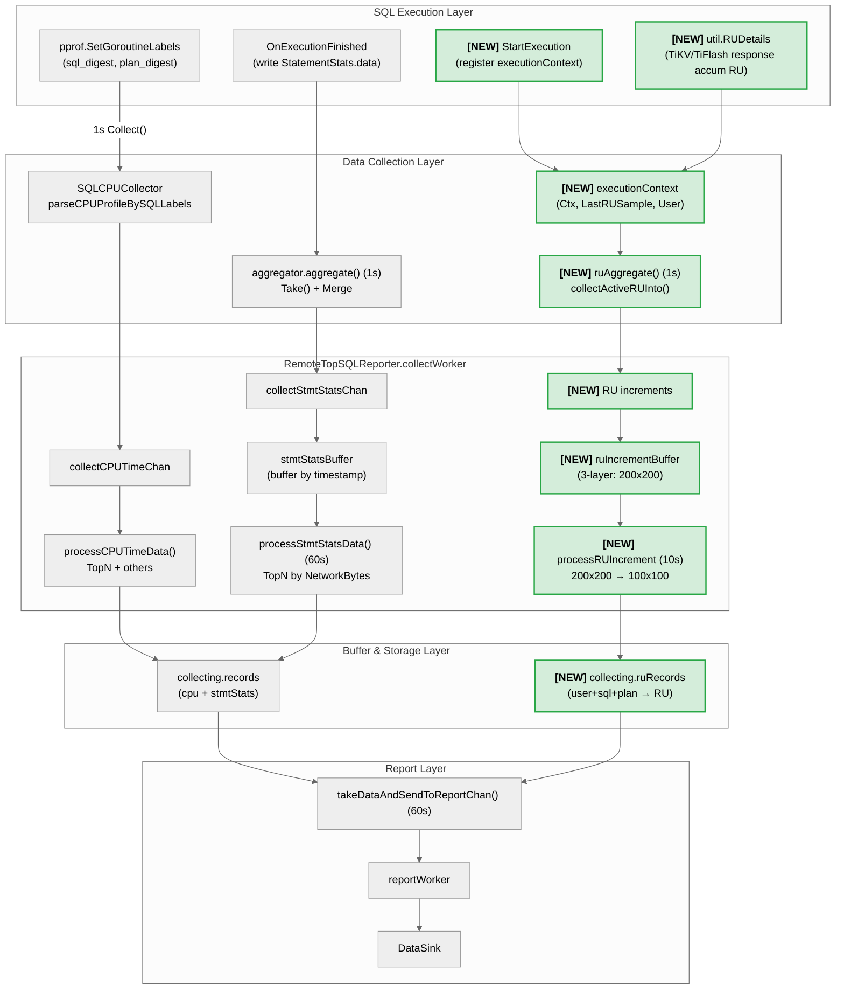

# TiDB TopRU 设计

- Author(s): [Your Name](http://github.com/your-github-id)
- Discussion PR: https://github.com/pingcap/tidb/pull/XXX
- Tracking Issue: https://github.com/pingcap/tidb/issues/XXX

## Table of Contents

* [Introduction](#introduction)
  * [Background](#background)
  * [Goals](#goals)
  * [Non-Goals](#non-goals)
* [Detailed Design](#detailed-design)
  * [Architecture Overview](#architecture-overview)
  * [功能与语义定义](#功能与语义定义)
    * [TopRU 定义](#topru-定义)
    * [功能开关](#功能开关)
  * [数据采集机制](#数据采集机制)
  * [数据模型与存储](#数据模型与存储)
  * [性能与风险分析](#性能与风险分析)
  * [与其他可观测性模块联动](#与其他可观测性模块联动)
* [Limitation](#limitation)
* [Compatibility Issues](#compatibility-issues)
* [Test Design](#test-design)
* [Impact & Risk](#impact--risk)
* [Investigation & Alternatives](#investigation--alternatives)

## Introduction

### Background

Next-gen TiDB Cloud 按 RU（Request Unit）计费。当集群 RU 消耗异常或达到限制时，用户需要快速定位高 RU 消耗的 SQL，但目前缺乏有效手段近实时识别 RU 消耗的主要 SQL。

**典型场景**：当集群达到 MAX RCU 限制并触发告警时，用户需要快速定位高 RU 消耗的 SQL，以便执行 Terminate 或优化操作，解除资源压力并恢复服务。

**现有方案的局限**：

| 方案 | 局限性 |
|------|--------|
| 慢日志 (Slow Log) | 仅记录已完成的慢查询，无法反映执行中 SQL 的 RU 消耗 |
| Statement Summary | 默认 30 分钟持久化，无法访问内存中的实时数据，不满足分钟级实时需求 |

**TopRU** 通过复用 TopSQL 基础设施，提供按 RU 消耗排序的近实时可观测能力，弥补上述不足。

### Goals

1. **按 RU 消耗排序**: 支持按累计 RU 消耗进行排序和查询，识别高 RU SQL（包括执行时间短但 RU 消耗大的 SQL）
2. **用户维度聚合**: 按 `(user, sql_digest, plan_digest)` 三元组维度聚合，支持按用户查看 RU 消耗分布
3. **实时统计与历史查询**: 
   - 本地 1 秒采样，支持执行中 SQL 的 RU 统计
   - 每 60 秒批量上报至外部组件（如 VM）
   - 支持查询最近时间段的 RU 消耗历史数据

   **“近实时”延迟范围定义（端到端）**：
   - 本地采样写入内存 buffer：<= 1s（一个采样周期内）
   - 外部系统可见性（用户侧）：约 `report_interval (默认 60s) + 下游写入/查询延迟`，通常为 60~120s
4. **兼容现有能力**: 与 TopSQL 现有的 CPU 时间统计功能并存，互不影响

### Non-Goals

1. **TopRU RU ≠ Billing RU**: TopRU 展示的 RU 来自 `util.RUDetails` 运行时观测值，与 Billing RU 的计费口径不一致，本期不做对齐工作
2. **执行中 SQL 完整信息保证**: 执行中 SQL 即使已消耗大量 RU，也可能因 SQL 尚未完成而无法获取完整的 slow query / SQL statement 相关信息
3. **异常检测与自动告警**: 自动检测 RU 消耗异常并生成告警的功能本期不做支持

## Detailed Design

### Architecture Overview

TopRU 采用**三层缓冲架构**，复用 TopSQL 的采集和上报链路，在保证实时性的同时控制内存开销。

**架构图**（`[NEW]` 标记为 TopRU 新增链路）：

```
+-------------------------------------------------------------------------------------------+
|                                   SQL Execution Layer                                     |
|  +------------------------------------+    +-------------------------------+              |
|  | pprof.SetGoroutineLabels()         |    | OnExecutionFinished           |              |
|  | (sql_digest, plan_digest label)    |    | (write StatementStats.data)   |              |
|  +-------------------+----------------+    +---------------+---------------+              |
|                      |                                     |                              |
|  [NEW] +-------------+-------------+    +------------------+-----------------+ [NEW]      |
||        | StartExecution             |    | util.RUDetails                   |             |
||        | (register executionContext)|    | (TiKV/TiFlash response accum RU) |             |
|        +-------------+--------------+    +------------------+----------------+             |
+----------------------|-------------------------------------|----------------|-------------+
                       | (CPU Time)          (StmtStats)     |  [NEW] (RU)    |
                       v                          |          v                v
+-------------------------------------------------------------------------------------------+
|                                   Data Collection Layer                                   |
|                                                                                           |
|  +----------------------------------+    +----------------------------------+             |
|  | SQLCPUCollector                  |    | StatementStats.data              |             |
|  | - profileConsumer recv profile   |    | map[SQLPlanDigest]*Item          |             |
|  | - parseCPUProfileBySQLLabels()   |    | - ExecCount, Duration            |             |
|  | - parse pprof label get CPU Time |    | - NetworkBytes, KvStats          |             |
|  +----------------+-----------------+    +----------------+-----------------+             |
|                   |                                       |                               |
|  [NEW] +----------+---------------------------------------------------+ [NEW]            |
|        | StatementStats.executionContext                              |                   |
|        | (Ctx, LastRUSample, SQLDigest, PlanDigest, User)             |                   |
|        +------------------------------+-------------------------------+                   |
|                                       |                                                   |
|                   v                   v                   v [NEW]                         |
|        Collect() per 1s    aggregator.aggregate()    ruAggregate() per 1s                 |
|                   |          per 1s Take()+Merge     collectActiveRUInto()                |
+-------------------|---------------------------|-------------------|------------------------+
                    |                           |                   |
                    v                           v                   v
+-------------------------------------------------------------------------------------------+
|                            RemoteTopSQLReporter.collectWorker                             |
|                                                                                           |
|  collectCPUTimeChan      collectStmtStatsChan          [NEW] collectRUIncrementsChan      |
|        |                          |                                |                      |
|        v                          v                                v                      |
|  processCPUTimeData()       stmtStatsBuffer              ruIncrementBuffer [NEW]          |
|  - TopN filter              (buffer by ts)               (3-layer filter:                 |
|  - evicted -> others              |                       200 users x 200 SQLs)           |
|        |                          v (60s)                          |                      |
|        |                    processStmtStatsData()                 v (10s) [NEW]          |
|        |                    - TopN by NetworkBytes           processRUIncrementBuffer()   |
|        |                    - merge to records               - 200x200 -> 100x100 filter  |
|        v                          |                                |                      |
|  +-----------------------------+--+------------------------------------+ [NEW]            |
|  | collecting.records          |  collecting.ruRecords                |                   |
|  | (key: sql+plan)             |  (key: user+sql+plan)                |                   |
|  | cpuTimeMs + stmtStats       |  TotalRU per (user, sql, plan)       |                   |
|  +-----------------------------+--------------------------------------+                   |
+--------------------------------------+----------------------------------------------------+
                                       | per 60s reportTicker
                                       v
+-------------------------------------------------------------------------------------------+
|                                      Report Layer                                         |
|  +-------------------------------------------------------------------------------------+  |
|  | takeDataAndSendToReportChan()                                                       |  |
|  | - getReportRecords(): sort by totalCPUTimeMs, take TopN                             |  |
|  | - [NEW] getRUReportRecords(): sort by totalRU, take TopN                            |  |
|  | -> reportCollectedDataChan -> reportWorker -> DataSink                              |  |
|  +-------------------------------------------------------------------------------------+  |
+-------------------------------------------------------------------------------------------+
```

**Mermaid 版**（淡绿色背景为 TopRU 新增链路）：



**设计原则**：

| 原则 | 说明 |
|------|------|
| 复用基础设施 | 采集点、上报链路、时间桶机制均复用 TopSQL 现有实现 |
| 前置过滤 | 1s 采集时即做三层过滤（200 users × 200 SQLs），避免 buffer 膨胀 |
| 分层存储 | 1s 写轻量 buffer (200×200) → 10s 二次过滤 (100×100) → 60s 批量上报，逐层控制内存 |
| 分离存储 | CPU 数据用 `collecting.records`，RU 数据用 `collecting.ruRecords`，互不影响 |
| 内存可控 | 三层过滤 + 硬上限保护，最坏情况内存占用 ~72 MB（10s 累积） |

**核心数据流**：

```
SQL 执行 → executionContext 注册 → 1s 采样写入 timestampBuffer
                                           ↓ (三层过滤: 200 users × 200 SQLs)
                                           ↓ (10s)
                                  二次过滤: 200×200 → 100×100 → ruRecords
                                           ↓ (60s)
                                  批量上报给 DataSink
```

### 功能与语义定义

#### TopRU 定义

**TopRU** 是 TiDB 提供的按 RU 消耗排序和查询 SQL 的可观测性功能，支持按用户维度聚合，帮助用户快速定位高 RU 消耗的 SQL。

**RU 计算**: `TotalRU = RRU + WRU`，通过 `util.RUDetails` 的 `RRU()` 和 `WRU()` 方法获取。RU 来源包括 TiKV 和 TiFlash 的响应。

**RUDetails 语义说明**：
- `util.RUDetails` 是运行时**累加型**指标：在 SQL 执行过程中，TiDB 在处理 TiKV/TiFlash 响应时持续将每次请求的 RU 消耗增量累加到 `RUDetails`。
- 因此采样时读取到的是“截至当前时刻的累计值”，TopRU 通过 `ruDelta = currentRU - lastRU` 计算采样周期内的 RU 增量，避免重复计数。

**聚合维度**: `(user, sql_digest, plan_digest)` 三元组
- `user`: 从 `SessionVars.User.Username` 获取
- `sql_digest`: SQL Digest，标识 SQL 语句模式
- `plan_digest`: Plan Digest，标识执行计划

#### 功能开关

TopRU 通过独立开关 `tidb_enable_top_ru` 控制（可以考虑复用 `tidb_enable_top_sql`，这里暂定使用独立变量）：

| 开关 | Scope             | 默认值    | 说明                         |
|------|------------------|--------|----------------------------|
| `tidb_enable_top_ru` | ScopeGlobal | false  | TopRU 独立开关，控制 TopRU 的采集与上报 |

**设计考量**：
- TopRU 作为独立功能，使用独立开关，与 TopSQL 解耦
- `tidb_enable_top_ru` 与 `tidb_enable_top_sql` 互不影响，可独立开启/关闭
- 开关状态变更无需重启，动态生效

**关闭时的行为**：
- 停止 RU 采样（`ruAggregate()` 跳过执行）
- 停止 RU 数据上报
- 已采集数据随下一个上报周期清空
- 不影响 TopSQL 现有功能

### 数据采集机制

#### 采集时机

| 采集点 | 频率 | 位置 | 目的 |
|--------|------|------|------|
| 本地定期采样 | 1s | `aggregator.ruAggregate()` | 采集执行中 SQL 的 RU 增量 |
| 执行完成采集 | 实时 | `observeStmtFinishedForTopSQL()` | 补充最终数据，确保准确性 |

#### ExecutionContext 设计

在 `StatementStats` 中新增 `executionContext` 字段，存储执行中 SQL 的采样状态：

```go
// ExecutionContext 存储当前执行的 SQL 上下文信息
type ExecutionContext struct {
    Ctx           context.Context   // 用于读取 util.RUDetails
    SQLDigest     []byte
    PlanDigest    []byte
    User          string
    LastRUSample  *atomic.Float64   // 上次采样值，用于计算增量
}

// StatementStats 扩展
type StatementStats struct {
    data             StatementStatsMap
    finished         *atomic.Bool
    mu               sync.Mutex
    executionContext *ExecutionContext  // 新增：当前执行上下文
}

// RUIncrementsMap 存储 RU 增量的轻量级 map
type RUIncrementsMap map[UserSQLPlanDigest]float64
```

**生命周期管理**：
- SQL 开始: `StartExecution()` 创建 executionContext
- RU 采样: `GetExecutionContext()` 读取并更新 LastRUSample
- SQL 完成: `FinishExecution()` 清空 executionContext

#### RU 增量计算

采用差值计算机制，避免重复计数：

```go
// collectActiveRUDelta 用于 1s 周期采样，计算执行中 SQL 的 RU 增量。
// 通过 CAS 更新 LastRUSample，若 CAS 失败（如 finish 路径已更新）则返回 ok=false。
func (s *StatementStats) collectActiveRUDelta(currentRU float64) (key UserSQLPlanDigest, delta float64, ok bool)

// collectFinalRUDelta 用于 SQL 执行完成时，采集最终的 RU 增量。
// 与 collectActiveRUDelta 类似，但在采集完成后会清空 executionContext。
func (s *StatementStats) collectFinalRUDelta(currentRU float64) (key UserSQLPlanDigest, delta float64, ok bool)
```

**边界处理**：
- `ruDelta <= 0`: 跳过本次采样
- `util.RUDetails` 为空: 跳过本次采样
- Resource Control 未启用（`tidb_enable_resource_control = OFF`）：跳过 RU 采集与上报（避免产生全 0 的无效数据）
- SQL 执行完成: 从活跃列表移除，不再采样

#### 数据流实现

**1s 采样（下沉到 aggregator）**：

```go
// aggregator.run() 扩展
func (m *aggregator) run() {
    tick := time.NewTicker(time.Second)
    defer tick.Stop()
    for {
        select {
        case <-m.ctx.Done():
            return
        case <-tick.C:
            m.aggregate()      // 现有 CPU/stmtstats 聚合
            m.ruAggregate()    // 新增 RU 聚合
        }
    }
}

// RU 聚合：遍历活跃 StatementStats，采样 RU 增量
func (m *aggregator) ruAggregate() {
    if !state.TopSQLEnabled() {
        return
    }
    // 前置检查：Resource Control 未启用时，RUDetails 全为 0，跳过采集避免无效数据
    if !vardef.EnableResourceControl.Load() {
        return
    }
    
    total := RUIncrementsMap{}
    m.statsSet.Range(func(statsR, _ any) bool {
        stats := statsR.(*StatementStats)
        if !stats.Finished() {
            stats.collectActiveRUInto(total)
        }
        return true
    })
    
    if len(total) > 0 {
        m.collectors.Range(func(c, _ any) bool {
            if rc, ok := c.(RUCollector); ok {
                rc.CollectRUIncrements(total)
            }
            return true
        })
    }
}
```

**相关接口说明**：

```go
// RUCollector 是可选扩展接口：不改变现有 Collector（CollectStmtStatsMap）即可接入 RU 采样数据。
type RUCollector interface {
    CollectRUIncrements(RUIncrementsMap)
}

// StatementStats.collectActiveRUInto：执行中采样路径，由 aggregator.ruAggregate() 调用。
// 内部读取 RUDetails → 计算 ruDelta → 写入 total。
func (s *StatementStats) collectActiveRUInto(total RUIncrementsMap)

// RemoteTopSQLReporter.CollectRUIncrements：reporter 接收 ruDelta map，并按 timestamp 写入 ruIncrementBuffer。
// 这里会触发三层过滤（Layer1/Layer2/othersRU）。
func (tsr *RemoteTopSQLReporter) CollectRUIncrements(incr stmtstats.RUIncrementsMap)
```

**1s 采集时内存控制（三层过滤方案）**：

为防止极端场景（1000 users × 5000 SQL）导致内存溢出，在 1s 采集时即做内存控制：

- **Layer 1**：每个 timestamp 最多 200 users，超限时比较新 user 与 minRU user，决定淘汰或替换
- **Layer 2**：每个 user 最多 200 SQLs，淘汰逻辑同 Layer 1
- **Layer 3**：被淘汰的 RU 汇总到 `_others_`

**相关数据结构和接口说明**

```go
const (
    MaxUsersPerTimestamp = 200
    MaxSQLPerUser        = 200
)

type timestampBuffer struct {
    users       map[string]*userBuffer   // user -> userBuffer
    userTotalRU map[string]float64       // user -> totalRU
    othersRU    float64                  // 淘汰的 RU 汇总
    minRUUser   string                   // 当前 minRU 的 user（用于淘汰决策）
}

type userBuffer struct {
    sqlRU    map[UserSQLPlanDigest]float64  // (sql, plan) -> RU
    minRUKey UserSQLPlanDigest              // 当前 minRU 的 SQL
}

func (tb *timestampBuffer) Add(key UserSQLPlanDigest, ruDelta float64)
func (ub *userBuffer) Add(key UserSQLPlanDigest, ruDelta float64, othersRU *float64)
```

**淘汰策略**：超限时比较新条目与 minRU 条目，若 `新RU > minRU` 则替换，否则直接计入 othersRU。minRU 默认用线性扫描维护，高基数场景可考虑 bounded min-heap 优化。

**10s 过滤与落桶**：

- 10s 周期性处理：`processRUIncrementBuffer()` 将 `ruIncrementBuffer` **二次过滤**后写入 `collecting.ruRecords`。
- 1s 写入时已做 200 users × 200 SQLs 的过滤，10s 处理时进一步收敛到 **100 users × 100 SQLs**：
  - 对所有 timestamp 的数据按 user 聚合，取 Top 100 users（按 userTotalRU 排序）
  - 每个 user 内取 Top 100 SQLs（按 sqlRU 排序）
  - 被淘汰的 user/SQL 的 RU 汇总到 `_others_`
  - 最终将过滤后的 `(user, sql_digest, plan_digest)` 数据写入对应 timestamp 的 `tsItem.TotalRU`
  - 将 `othersRU`（包含 1s 过滤淘汰 + 10s 过滤淘汰）写入 `collecting.appendOthersRU(timestamp, othersRU)`

```go
func (tsr *RemoteTopSQLReporter) processRUIncrementBuffer()
```

### 数据模型与存储

#### 存储方案

采用**分层存储方案**（方案 C），`collecting.records` 存 CPU 数据，`collecting.ruRecords` 存 RU 数据，互不影响。

**方案对比**：

| 方案 | 描述 | 评估 |
|------|------|------|
| A: 扩展 records key | 将 records 改为 `(user, sql, plan)` key | ❌ 侵入性高，改变 TopSQL 语义 |
| B: 内嵌 RUByUser | 在 tsItem 内嵌 `map[user]ru` | ❌ 内存/GC 风险高 |
| **C: 分层存储** | 新增独立的 `ruRecords` | ✅ 侵入性低，边界清晰 |

**选择理由**：
- 不改变现有 TopSQL（CPU TopN）的语义与主干实现
- 直接满足"每 user Top 100 & user ≤ 100"的产品约束
- 与 `collectWorker/reportWorker` 的 60s 上报链路天然匹配

#### 数据结构扩展

**TopRU 上报字段**（与产品侧确认）：

| 字段名 | 类型      | 说明 |
|--------|---------|------|
| Keyspace | []byte  | SQL 所属 Keyspace |
| User | string  | SQL 执行用户 |
| SQLDigest | []byte  | SQL Digest，标识 SQL 语句模式 |
| PlanDigest | []byte  | Plan Digest，标识执行计划 |
| TotalRU | float64 | 累计 RU 消耗（RRU + WRU） |
| ExecCount | uint64  | 执行次数 |
| SumDurationNs | uint64  | 累计执行时间（纳秒） |

```go
// StatementStatsItem 扩展
type StatementStatsItem struct {
    // ... 现有字段 ...
    TotalRU float64  // 新增：累计总 RU
}

// record 扩展
type record struct {
    sqlDigest      []byte
    planDigest     []byte
    user           string   // 新增：用户名
    tsItems        tsItems
    totalCPUTimeMs uint64
    totalRU        float64  // 新增：累计总 RU
}

// collecting 扩展
type collecting struct {
    records   map[string]*record  // CPU 数据 (key: sql+plan)
    ruRecords map[string]*record  // RU 数据 (key: user+sql+plan)，新增
    // ...
}
```

#### Protobuf 扩展

TopRU 上报数据通过 Protobuf 协议与外部组件交互，复用 TopSQL 现有的 `SQLMeta` 和 `PlanMeta` 定义，新增 `TopRURecord` 消息类型。协议讨论细节参考：https://pingcap.feishu.cn/docx/ZLrBdNBkjo5jtcxAzSHcgEiYnZb

**协议定义**：

```protobuf
// TopRURecord 表示单个 (user, sql_digest, plan_digest) 组合的 RU 统计数据
message TopRURecord {
    bytes  keyspace_name = 1;  // Keyspace 标识
    string user          = 2;  // 执行用户
    bytes  sql_digest    = 3;  // SQL Digest
    bytes  plan_digest   = 4;  // Plan Digest
    repeated TopRURecordItem items = 5;  // 时间序列数据
}

// TopRURecordItem 表示单个时间桶内的统计数据
message TopRURecordItem {
    uint64 timestamp_sec = 1;  // 时间戳（秒）
    double total_ru      = 2;  // 累计 RU 消耗
    uint64 exec_count    = 3;  // 执行次数
    uint64 exec_duration = 4;  // 累计执行时间（纳秒）
}
```

**TiDB 侧上报数据结构**：

```go
type ReportData struct {
    DataRecords []tipb.TopSQLRecord    // TopSQL: (sql_digest, plan_digest) → CPU/exec/latency（现有）
    SQLMetas    []tipb.SQLMeta         // SQL 元数据（复用）
    PlanMetas   []tipb.PlanMeta        // Plan 元数据（复用）
    RURecords   []tipb.TopRURecord     // TopRU: (user, sql_digest, plan_digest) → RU（新增）
}
```

**设计说明**：
- `TopRURecord` 与 `TopSQLRecord` 并列，分别承载 RU 和 CPU 维度的数据
- `SQLMetas` 和 `PlanMetas` 在 TopSQL 和 TopRU 之间共享，避免重复传输
- 协议演进承诺：仅新增字段，不修改/复用已有字段编号，不改变已有字段语义

详细协议讨论参考：[TiDB TopRU 协议讨论稿](https://pingcap.feishu.cn/docx/ZLrBdNBkjo5jtcxAzSHcgEiYnZb)

### 性能与风险分析

#### 性能优化措施

- **内存**：三层缓冲设计，1s 写轻量 buffer，10s 过滤后才创建重对象
- **CPU**：RU 采集复用 aggregator 的 1s tick，不增加额外采集周期
- **CPU/算法**：可选优化，三层过滤中 minRU 维护默认用线性扫描；在高基数/频繁淘汰场景可用 bounded min-heap 等结构维护 minRU，降低扫描开销（是否引入以 benchmark 为准）
- **采样频率**：可选优化，当前默认 1s 采样，由于用户可见数据为分钟级更新，可考虑降低采样频率至 5s/10s 以减少 CPU 开销
- **GC/alloc**：可选优化，对 digest 编码/拷贝等临时 buffer 复用（如 `sync.Pool`），降低高 QPS 下的小对象分配与GC 压力
- **并发**：executionContext 使用 RWMutex（读多写少），减少锁竞争
- **网络**：60s 批量上报，复用 TopSQL 现有上报链路

#### 风险与缓解

- **OOM**：复用 TopSQL 现有内存管理机制 + ruIncrementBuffer 硬上限保护
- **CPU 突增**：RU 采集与 CPU 采集在同一调用路径，开销可控
- **数据不准确**：Resource Control 未启用时 TopRU 跳过 RU 采集与上报（避免无效的全 0 数据）；启用后才统计 RU

### 与其他可观测性模块联动

- 可观测系统（用户侧） ：使用 `(sql_digest, plan_digest)` 作为关联键，支持跳转到慢日志详情或者 Statement Summary。

## Limitation

1. **采集链路有界缓冲导致的丢数**：采集链路使用有界 channel（容量=2）传递数据，采用非阻塞发送避免影响 SQL 执行。当 `collectWorker` 处理不及时（如 GC pause、处理逻辑耗时）导致 channel 打满时，新的采样批次会被丢弃，可通过 `IgnoreCollectChannelFullCounter` 监控指标观测。此行为与 TopSQL 相同。

2. **数据精度影响**：
   - **边界 SQL 的历史数据可能丢失**：未进入 Top 100 的 SQL，其 RU 数据汇总到 `"_others_"`，后续无法追溯
   - **TopN 边界抖动**：第 99-102 名的 SQL 可能反复进出 Top 100
   - **缓解**：内部维护 Top 150，对外查询 Top 100，留余量减少抖动

3. **跨节点限制**: 数据仅在当前 TiDB 节点收集，复用 TopSQL 现有跨节点限制

### Upgrade Compatibility

- **版本升级**：TopRU 作为新功能自动可用，无需额外配置
- **Protobuf**：RU 字段使用 optional，旧客户端可忽略新字段
- **数据**：内存数据不持久化，升级后重新采集

## Test Design

### Functional Test

- **数据采集**：本地采样/执行完成采集正确性、RU 增量计算、executionContext 生命周期
- **聚合**：`(user, sql_digest, plan_digest)` 聚合正确性、不同用户相同 SQL 分别统计
- **查询**：按 RU 排序、按 user 维度查询、Top N 排序、RU Share Percent 计算
- **边界**：RU = 0（Resource Control 未启用）、user 为空（内部 SQL）、执行时间 < 1s

### Performance Test

- 基准测试：测量本地采样和上报开销，验证内存占用
  - 1000 users × 500 条活跃 SQL 采集
- 压力测试：高 QPS 场景下的性能影响评估
  - 观察 CPU 和内存使用
- 回归测试：确保 TopSQL 现有性能不受影响

### Compatibility Test

- Resource Control 启用/禁用场景
- Protobuf 向前兼容性
- 与 TopSQL 现有功能的共存
  - 从旧版本 TopSQL 升级后的行为

## Impact & Risk

风险与缓解措施详见「性能与风险分析」章节。

### Rollback Plan

TopRU 功能支持通过配置开关动态禁用，无需重启：
- 禁用后停止采样和上报
- 已采集数据随上报周期清空
- 不影响 TopSQL 现有功能

## Investigation & Alternatives

### 原方案：10s 聚合 TopK 过滤

**原方案描述**：
- 1s 采集时将所有 RU 增量写入 `ruIncrementBuffer`，不做过滤
- 10s 时触发聚合，对每个 user 的 SQL 按 totalRU 排序，取 Top 100
- 超出 Top 100 的 SQL 汇总到 `_others_`

**内存估算基准**（基于 TopRU 上报字段）：

| 字段 | 类型 | 大小 |
|------|------|------|
| Keyspace | []byte | ~16 字节 |
| User | string | ~16 字节（平均用户名） |
| SQLDigest | []byte | 32 字节（SHA256） |
| PlanDigest | []byte | 32 字节（SHA256） |
| TotalRU | float64 | 8 字节 |
| ExecCount | uint64 | 8 字节 |
| SumDurationNs | uint64 | 8 字节 |
| **合计** | | **~120 字节/条目** |

**不足之处**：

1. **内存风险高**：
   - 极端场景（1000 users × 5000 SQL）下，`ruIncrementBuffer` 可能在 1s 内膨胀到 500 万条目
   - 每条目约 120 字节，1s 内存占用可达 ~600 MB，10s 累积可能达到 **6 GB**
   - 高并发场景下极易触发 OOM

2. **计算开销大**：
   - 10s 聚合时需要对所有 users 的所有 SQL 进行全量排序
   - 1000 users × 5000 SQL 的排序复杂度为 O(n log n)，耗时可能超过百毫秒
   - 影响 collectWorker 主循环，可能导致上报延迟

3. **缺乏前置保护**：
   - 1s 采集时不做限流，完全依赖 10s 过滤
   - 如果 10s 过滤失败或延迟，内存可能失控
