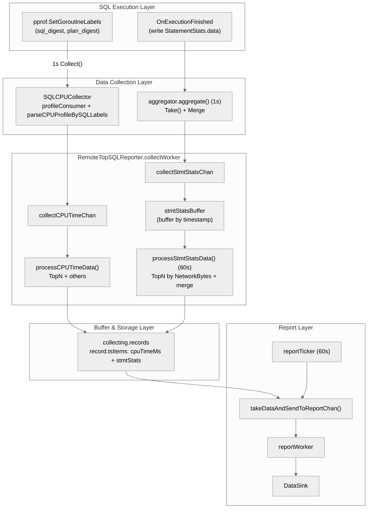
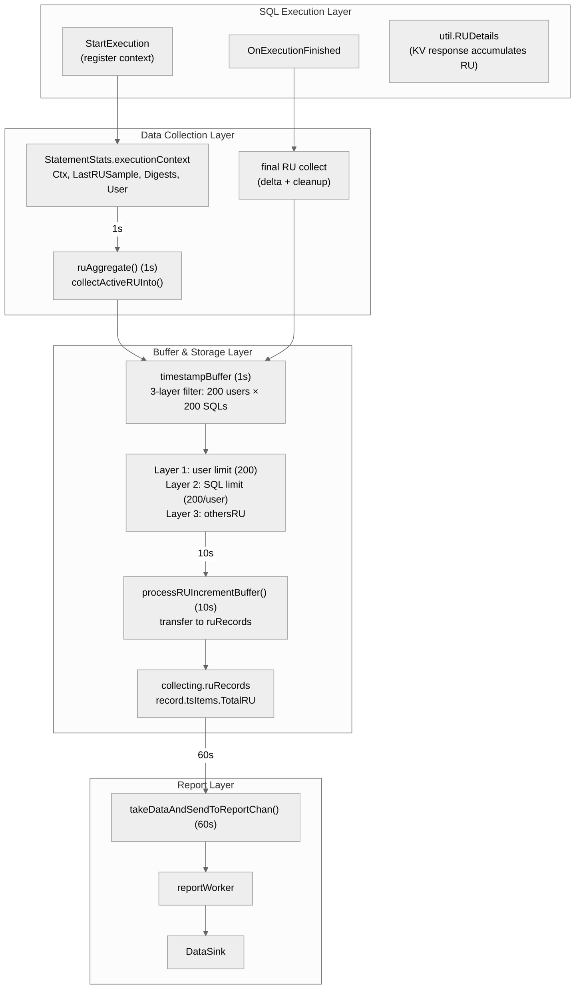

# TiDB TopRU 设计

- Author(s): [Your Name](http://github.com/your-github-id)
- Discussion PR: https://github.com/pingcap/tidb/pull/XXX
- Tracking Issue: https://github.com/pingcap/tidb/issues/XXX

## Table of Contents

* [Introduction](#introduction)
  * [Background](#background)
  * [Goals](#goals)
  * [Non-Goals](#non-goals)
* [Detailed Design](#detailed-design)
  * [Architecture Overview](#architecture-overview)
  * [功能与语义定义](#功能与语义定义)
    * [TopRU 定义](#topru-定义)
    * [功能开关](#功能开关)
    * [关键特性](#关键特性)
  * [数据采集机制](#数据采集机制)
  * [数据模型与存储](#数据模型与存储)
  * [性能与风险分析](#性能与风险分析)
  * [与其他可观测性模块联动](#与其他可观测性模块联动)
* [Limitation](#limitation)
* [Compatibility Issues](#compatibility-issues)
* [Test Design](#test-design)
* [Impact & Risk](#impact--risk)
* [Investigation & Alternatives](#investigation--alternatives)

## Introduction

### Background

Next-gen TiDB Cloud 按 RU（Request Unit） 计费。当集群 RU 消耗异常或达到限制时，用户需要快速定位高 RU 消耗的 SQL，但目前缺乏有效手段识别 RU 消耗的主要来源。

TopRU 的核心价值：当监控系统检测到 RU 限流事件时，TopRU 提供对高消耗 SQL 的近实时可见性，使用户能够：
•  按 RU 消耗排序，快速定位高资源消耗的 SQL
•  按用户维度聚合，识别资源消耗的来源账户
•  为后续的查询优化或资源治理提供数据依据

典型场景：当集群达到 MAX RCU 限制并触发告警时，用户需要快速定位高 RU 消耗的 SQL，以便执行 Terminate 或优化操作，解除资源压力并恢复服务。

**现有方案的局限**：

| 方案 | 局限性 |
|------|--------|
| 慢日志 (Slow Log) | 仅记录已完成的慢查询，无法反映执行中 SQL 的 RU 消耗 |
| Statement Summary | 默认 30 分钟持久化，无法访问内存中的实时数据，不满足分钟级实时需求 |

**TopRU** 通过复用 TopSQL 基础设施，提供按 RU 消耗排序的近实时可观测能力，弥补上述不足。

### Goals

1. **按 RU 消耗排序**: 支持按累计 RU 消耗进行排序和查询，识别高 RU SQL（包括执行时间短但 RU 消耗大的 SQL）
2. **用户维度聚合**: 按 `(user, sql_digest, plan_digest)` 三元组维度聚合，支持按用户进行资源治理和配额管理
3. **实时统计与历史查询**: 
   - 本地 1 秒采样，支持执行中 SQL 的 RU 统计
   - 每 60 秒批量上报至外部组件（如 VM）
   - 支持查询最近时间段的 RU 消耗历史数据
4. **兼容现有能力**: 与 TopSQL 现有的 CPU 时间统计功能并存，互不影响

### Non-Goals

1. **TopRU RU ≠ Billing RU**: TopRU 展示的 RU 来自 `util.RUDetails` 运行时观测值，与 Billing RU 的计费口径不保证一致，本期不做对齐工作
2. **执行中 SQL 完整信息保证**: 执行中 SQL 即使已消耗大量 RU，也可能因 SQL 尚未完成而无法获取完整的 slow query / SQL statement 相关信息
3. **RU Baseline 智能对比**: 基于历史数据的 baseline 计算、异常评分等高级分析功能作为本期不支持
4. **异常检测与自动告警**: 自动检测 RU 消耗异常并生成告警的功能本期不做支持

## Detailed Design

### Architecture Overview

TopRU 采用**三层缓冲架构**，复用 TopSQL 的采集和上报链路，在保证实时性的同时控制内存开销。

**现有 TopSQL 架构（CPU Time / StatementStats）**：

```
+---------------------------------------------------------------------------------+
|                            SQL Execution Layer                                  |
|  +------------------------------------+    +-------------------------------+    |
|  | pprof.SetGoroutineLabels()         |    | OnExecutionFinished           |    |
|  | (sql_digest, plan_digest label)    |    | (write StatementStats.data)   |    |
|  +-------------------+----------------+    +---------------+---------------+    |
+----------------------|-------------------------------------|--------------------|+
                       | (CPU Time pipeline)                 | (StmtStats pipeline)
                       v                                     v
+---------------------------------------------------------------------------------+
|                          Data Collection Layer                                  |
|                                                                                 |
|  +----------------------------------+    +----------------------------------+   |
|  | SQLCPUCollector                  |    | StatementStats.data              |   |
|  | - profileConsumer recv profile   |    | map[SQLPlanDigest]*Item          |   |
|  | - parseCPUProfileBySQLLabels()   |    | - ExecCount, Duration            |   |
|  | - parse pprof label get CPU Time |    | - NetworkBytes, KvStats          |   |
|  +----------------+-----------------+    +----------------+-----------------+   |
|                   |                                       |                     |
|                   v Collect() per 1s                      v aggregator.aggregate()
|                   |                                       | per 1s Take() + Merge
|  +----------------+---------------------------------------+------------------+  |
|  |                      RemoteTopSQLReporter.collectWorker                   |  |
|  |  collectCPUTimeChan        collectStmtStatsChan                           |  |
|  |        |                          |                                       |  |
|  |        v                          v                                       |  |
|  |  processCPUTimeData()       stmtStatsBuffer (buffer by timestamp)         |  |
|  |  - TopN filter                    |                                       |  |
|  |  - evicted -> others              v                                       |  |
|  |        |                    processStmtStatsData() (per 60s)              |  |
|  |        |                    - TopN by NetworkBytes                        |  |
|  |        |                    - merge to collecting.records                 |  |
|  |        v                          |                                       |  |
|  |  +-----------------------------+--+------------------------------------+  |  |
|  |  | collecting.records                                                  |  |  |
|  |  | map[string]*record  (key: sql_digest + plan_digest)                 |  |  |
|  |  | - record.tsItems: cpuTimeMs + stmtStats (merge same timestamp)      |  |  |
|  |  +---------------------------------------------------------------------+  |  |
|  +--------------------------------------+------------------------------------+  |
+-----------------------------------------|---------------------------------------+
                                          | per 60s reportTicker
                                          v
+---------------------------------------------------------------------------------+
|                              Report Layer                                       |
|  +---------------------------------------------------------------------------+  |
|  | takeDataAndSendToReportChan()                                             |  |
|  | - getReportRecords(): sort by totalCPUTimeMs, take TopN                   |  |
|  | -> reportCollectedDataChan -> reportWorker -> DataSink                    |  |
|  +---------------------------------------------------------------------------+  |
+---------------------------------------------------------------------------------+
```

Mermaid 版：



**TopRU 扩展架构（新增 RU 采集链路）**：

```
+-------------------------------------------------------------------------+
|                           SQL Execution Layer                           |
|  +--------------+    +------------------+    +------------------------+ |
|  | StartExecution|    | OnExecution      |    | util.RUDetails         | |
|  | (register ctx)|    | Finished         |    | (KV response accum RU) | |
|  +------+-------+    +--------+---------+    +-----------+------------+ |
+---------|--------------------|-------------------------|----------------+
          |                    |                         |
          v                    v                         v
+-------------------------------------------------------------------------+
|                        Data Collection Layer                            |
|  +-------------------------------------------------------------------+  |
|  | StatementStats.executionContext                                   |  |
|  | (store running SQL ctx: Ctx, LastRUSample, SQLDigest, User)       |  |
|  +-------------------------------------------------------------------+  |
|                              |                                          |
|              +---------------+---------------+                          |
|              v                               v                          |
|    +------------------+            +------------------+                  |
|    | 1s periodic sample|            | on finish collect |                 |
|    | (ruAggregate)    |            | (final data)     |                  |
|    +--------+---------+            +--------+---------+                  |
|             +---------------+---------------+                           |
+-----------------------------|-----------------------------------------+
                              v
+-------------------------------------------------------------------------+
|                        Buffer & Storage Layer                           |
|                                                                         |
|  Layer 1: ruIncrementBuffer (1s write, with 3-layer filtering)          |
|  +-------------------------------------------------------------------+  |
|  | timestampBuffer: map[uint64]*timestampBuffer                      |  |
|  |   - Layer 1: max 200 users per timestamp                          |  |
|  |     - track userTotalRU, evict minRU user when > 200              |  |
|  |   - Layer 2: max 200 SQLs per user                                |  |
|  |     - track sqlRU, evict minRU SQL when > 200                     |  |
|  |   - Layer 3: othersRU (evicted RU aggregated here)                |  |
|  +-------------------------------------------------------------------+  |
|                              | per 10s transfer to ruRecords            |
|                              v                                          |
|  Layer 2: collecting.ruRecords (10s write)                              |
|  +-------------------------------------------------------------------+  |
|  | map[string]*record  (heavy object: ~180 bytes/record)             |  |
|  | - key: user + sqlDigest + planDigest                              |  |
|  | - memory limit: 200 users x 200 SQLs = 40,000 max                 |  |
|  | - each record contains tsItems time bucket data                   |  |
|  +-------------------------------------------------------------------+  |
|                              | per 60s trigger report                   |
|                              v                                          |
|  Layer 3: Report (60s report)                                           |
|  +-------------------------------------------------------------------+  |
|  | takeDataAndSendToReportChan() -> reportWorker -> DataSink         |  |
|  | - reuse TopSQL existing report pipeline                           |  |
|  | - RU data batch reported with CPU data                            |  |
|  +-------------------------------------------------------------------+  |
+-------------------------------------------------------------------------+
```

Mermaid 版：



**设计原则**：

| 原则 | 说明 |
|------|------|
| 复用基础设施 | 采集点、上报链路、时间桶机制均复用 TopSQL 现有实现 |
| 前置过滤 | 1s 采集时即做三层过滤（200 users × 200 SQLs），避免 buffer 膨胀 |
| 分层存储 | 1s 写轻量 buffer → 10s 平移到重对象 → 60s 批量上报，逐层控制内存 |
| 分离存储 | CPU 数据用 `collecting.records`，RU 数据用 `collecting.ruRecords`，互不影响 |
| 内存可控 | 三层过滤 + 硬上限保护，最坏情况内存占用 ~72 MB（10s 累积） |

**核心数据流**：

```
SQL 执行 → executionContext 注册 → 1s 采样写入 timestampBuffer
                                           ↓ (三层过滤: 200 users × 200 SQLs)
                                           ↓ (10s)
                                  平移到 ruRecords
                                           ↓ (60s)
                                  批量上报给 DataSink
```

### 功能与语义定义

#### TopRU 定义

**TopRU** 是 TiDB 提供的按 RU 消耗排序和查询 SQL 的可观测性功能，支持按用户维度聚合，帮助用户快速定位高 RU 消耗的 SQL。

**RU 计算**: `TotalRU = RRU + WRU`，通过 `util.RUDetails` 的 `RRU()` 和 `WRU()` 方法获取。

**聚合维度**: `(user, sql_digest, plan_digest)` 三元组
- `user`: 从 `SessionVars.User.Username` 获取
- `sql_digest`: SQL Digest，标识 SQL 语句模式
- `plan_digest`: Plan Digest，标识执行计划

#### 功能开关

TopRU 通过独立开关 `tidb_enable_top_ru` 控制（可以考虑复用 `tidb_enable_top_sql`，这里暂定使用独立变量）：

| 开关 | Scope             | 默认值    | 说明                         |
|------|------------------|--------|----------------------------|
| `tidb_enable_top_ru` | ScopeGlobal | false  | TopRU 独立开关，控制 TopRU 的采集与上报 |

**设计考量**：
- TopRU 作为独立功能，使用独立开关，与 TopSQL 解耦
- `tidb_enable_top_ru` 与 `tidb_enable_top_sql` 互不影响，可独立开启/关闭
- 开关状态变更无需重启，动态生效

**关闭时的行为**：
- 停止 RU 采样（`ruAggregate()` 跳过执行）
- 停止 RU 数据上报
- 已采集数据随下一个上报周期清空
- 不影响 TopSQL 现有功能

#### 关键特性

| 特性 | 说明 |
|------|------|
| 排序依据 | RU 消耗（累计 RRU + WRU） |
| 统计对象 | 已完成的 SQL + 执行中的 SQL（通过定期采样） |
| 更新频率 | 本地 1s 采集，60s 上报 |
| 聚合维度 | User + SQL Digest + Plan Digest |
| 时间窗口 | 基于时间桶机制（PrecisionSeconds），支持历史数据查询 |
| 数据保留 | 内存中短期保留，复用 TopSQL 现有保留策略 |

### 数据采集机制

#### 采集时机

| 采集点 | 频率 | 位置 | 目的 |
|--------|------|------|------|
| 本地定期采样 | 1s | `aggregator.ruAggregate()` | 采集执行中 SQL 的 RU 增量 |
| 执行完成采集 | 实时 | `observeStmtFinishedForTopSQL()` | 补充最终数据，确保准确性 |
| 上报/持久化 | 60s | `collectWorker` | 批量发送给外部组件 |

#### ExecutionContext 设计

在 `StatementStats` 中新增 `executionContext` 字段，存储执行中 SQL 的采样状态：

```go
// ExecutionContext 存储当前执行的 SQL 上下文信息
type ExecutionContext struct {
    Ctx           context.Context   // 用于读取 util.RUDetails
    LastRUSample  *atomic.Float64   // 上次采样值，用于计算增量
    SQLDigest     []byte
    PlanDigest    []byte
    User          string
}

// StatementStats 扩展
type StatementStats struct {
    data             StatementStatsMap
    finished         *atomic.Bool
    mu               sync.Mutex
    executionContext *ExecutionContext  // 新增：当前执行上下文
}

// RUIncrementsMap 存储 RU 增量的轻量级 map
type RUIncrementsMap map[UserSQLPlanDigest]float64
```

**生命周期管理**：
- SQL 开始: `StartExecution()` 创建 executionContext
- RU 采样: `GetExecutionContext()` 读取并更新 LastRUSample
- SQL 完成: `FinishExecution()` 清空 executionContext

#### RU 增量计算

采用差值计算机制，避免重复计数：

```go
// 统一的 RU 增量计算逻辑
func (s *StatementStats) collectRUDelta(currentRU float64) (key UserSQLPlanDigest, delta float64, ok bool) {
    execCtx := s.GetExecutionContext()
    if execCtx == nil {
        return UserSQLPlanDigest{}, 0, false
    }
    
    lastRU := execCtx.LastRUSample.Load()
    delta = currentRU - lastRU
    if delta <= 0 {
        return UserSQLPlanDigest{}, 0, false
    }

    if !execCtx.LastRUSample.CompareAndSwap(lastRU, currentRU) {
        return UserSQLPlanDigest{}, 0, false
    }
    
    key = UserSQLPlanDigest{
        User:       execCtx.User,
        SQLDigest:  BinaryDigest(execCtx.SQLDigest),
        PlanDigest: BinaryDigest(execCtx.PlanDigest),
    }
    return key, delta, true
}
```

**边界处理**：
- `ruDelta <= 0`: 跳过本次采样
- `util.RUDetails` 为空: 跳过本次采样
- SQL 执行完成: 从活跃列表移除，不再采样

#### 数据流实现

**1s 采样（下沉到 aggregator）**：

```go
// aggregator.run() 扩展
func (m *aggregator) run() {
    tick := time.NewTicker(time.Second)
    defer tick.Stop()
    for {
        select {
        case <-m.ctx.Done():
            return
        case <-tick.C:
            m.aggregate()      // 现有 CPU/stmtstats 聚合
            m.ruAggregate()    // 新增 RU 聚合
        }
    }
}

// RU 聚合：遍历活跃 StatementStats，采样 RU 增量
func (m *aggregator) ruAggregate() {
    if !state.TopSQLEnabled() {
        return
    }
    
    total := RUIncrementsMap{}
    m.statsSet.Range(func(statsR, _ any) bool {
        stats := statsR.(*StatementStats)
        if !stats.Finished() {
            stats.collectActiveRUInto(total)
        }
        return true
    })
    
    if len(total) > 0 {
        m.collectors.Range(func(c, _ any) bool {
            if rc, ok := c.(RUCollector); ok {
                rc.CollectRUIncrements(total)
            }
            return true
        })
    }
}
```

**1s 采集时内存控制（三层过滤方案）**：

为防止极端场景（1000 users × 5000 SQL）导致内存溢出，在 1s 采集时即做内存控制，采用**三层过滤机制**：

- **Layer 1: 限制每个 timestamp 的 user 数量**：每个 timestamp 记录 Top 200 users（按该 user 下所有 SQL 的 totalRU 排序），超限时新 user 的 totalRU 若不大于当前 minTotalRU 则放入 others；若大于则替换 minTotalRU 的 user，并将原 user 放入 others
- **Layer 2: 限制每个 user 的 SQL 数量**：每个 user 记录 Top 200 SQLs（按该 SQL 的 totalRU 排序），超限时新 SQL 的 totalRU 若不大于当前 minTotalRU 则放入 others；若大于则替换 minTotalRU 的 SQL，并将原 SQL 放入 others
- **Layer 3: Others 兜底**：所有被过滤/淘汰的 RU 汇总到 `_others_`

**核心思路**：
1. 每个 timestamp 维护一个 `timestampBuffer`，内部按 user 组织数据
2. 每个 user 维护一个 `userBuffer`，记录该 user 下所有 SQL 的 totalRU
3. 到达第 201 个 user 时，对比新 user 的 totalRU 与当前 minTotalRU：
   - 若 `新user.totalRU <= minTotalRU`：直接放入 others
   - 若 `新user.totalRU > minTotalRU`：替换 minTotalRU 的 user，原 user 放入 others
4. 同理，每个 user 内到达第 201 个 SQL 时，采用相同逻辑比较和淘汰

```go
// 配置参数
const (
    MaxUsersPerTimestamp = 200   // 每个 timestamp 最多 200 users
    MaxSQLPerUser        = 200   // 每个 user 最多 200 SQL
    MinRUThreshold       = 0.01  // RU 增量 < 0.01 直接忽略（可选优化）
)

// timestampBuffer：每个 timestamp 的 buffer，三层过滤的 Layer 1
type timestampBuffer struct {
    users       map[string]*userBuffer  // user -> userBuffer
    userTotalRU map[string]float64      // user -> 该 user 下所有 SQL 的总 RU
    minRUUser   string                  // 当前 totalRU 最小的 user
    minRUValue  float64                 // 最小 totalRU 值
    minRUDirty  bool                    // 是否需要重新计算 min
    othersRU    float64                 // 被淘汰的 RU 汇总（Layer 3）
}

// userBuffer：每个 user 的 buffer，三层过滤的 Layer 2
type userBuffer struct {
    sqlRU      map[UserSQLPlanDigest]float64  // SQL key -> totalRU
    minRUKey   UserSQLPlanDigest              // 当前 totalRU 最小的 SQL
    minRUValue float64                        // 最小 totalRU 值
    minRUDirty bool                           // 是否需要重新计算 min
}

// 核心逻辑：添加 RU 增量到 timestampBuffer
func (tb *timestampBuffer) Add(key UserSQLPlanDigest, ruDelta float64) {
    // 可选：前置阈值过滤
    if ruDelta < MinRUThreshold {
        return
    }
    user := key.User
    
    // Case 1: user 已存在，直接累加
    if userBuf, exists := tb.users[user]; exists {
        userBuf.Add(key, ruDelta, &tb.othersRU)
        tb.userTotalRU[user] += ruDelta
        // 更新 minRUValue（如果当前操作的是 minRUUser）
        if user == tb.minRUUser {
            tb.minRUValue += ruDelta
        }
        return
    }
    
    // Case 2: 新 user，未达上限，直接添加
    if len(tb.users) < MaxUsersPerTimestamp {
        tb.addNewUser(user, key, ruDelta)
        tb.updateMinUser(user, ruDelta)
        return
    }
    
    // Case 3: 新 user，已达上限（第 201 个 user），需要比较 totalRU
    tb.refreshMinUserIfDirty()
    if ruDelta <= tb.minRUValue {
        // 新 user 的 totalRU 不大于当前最小值，直接放入 others
        tb.othersRU += ruDelta
        return
    }
    // 新 user 的 totalRU 大于当前最小值，替换 minRUUser
    tb.evictMinUser()  // 将原 minRUUser 的所有 RU 放入 others
    tb.addNewUser(user, key, ruDelta)
    tb.minRUDirty = true  // 需要重新计算 min
}

func (tb *timestampBuffer) addNewUser(user string, key UserSQLPlanDigest, ruDelta float64) {
    userBuf := &userBuffer{
        sqlRU:      make(map[UserSQLPlanDigest]float64),
        minRUValue: ruDelta,
        minRUKey:   key,
    }
    userBuf.sqlRU[key] = ruDelta
    tb.users[user] = userBuf
    tb.userTotalRU[user] = ruDelta
}

func (tb *timestampBuffer) updateMinUser(user string, ruDelta float64) {
    if tb.minRUUser == "" || ruDelta < tb.minRUValue {
        tb.minRUUser = user
        tb.minRUValue = ruDelta
    }
}

func (tb *timestampBuffer) evictMinUser() {
    // 将被淘汰的 user 的所有 RU 汇总到 others
    tb.othersRU += tb.userTotalRU[tb.minRUUser]
    delete(tb.users, tb.minRUUser)
    delete(tb.userTotalRU, tb.minRUUser)
}

func (tb *timestampBuffer) refreshMinUserIfDirty() {
    if !tb.minRUDirty && tb.minRUUser != "" {
        return
    }
    var minUser string
    minRU := math.MaxFloat64
    for user, ru := range tb.userTotalRU {
        if ru < minRU {
            minRU = ru
            minUser = user
        }
    }
    tb.minRUUser = minUser
    tb.minRUValue = minRU
    tb.minRUDirty = false
}

// userBuffer.Add：Layer 2 - 限制每个 user 的 SQL 个数
func (ub *userBuffer) Add(key UserSQLPlanDigest, ruDelta float64, othersRU *float64) {
    // Case 1: SQL 已存在，直接累加
    if _, exists := ub.sqlRU[key]; exists {
        ub.sqlRU[key] += ruDelta
        // 更新 minRUValue（如果当前操作的是 minRUKey）
        if key == ub.minRUKey {
            ub.minRUValue += ruDelta
        }
        return
    }
    
    // Case 2: 新 SQL，未达上限，直接添加
    if len(ub.sqlRU) < MaxSQLPerUser {
        ub.sqlRU[key] = ruDelta
        if ruDelta < ub.minRUValue || len(ub.sqlRU) == 1 {
            ub.minRUKey = key
            ub.minRUValue = ruDelta
        }
        return
    }
    
    // Case 3: 新 SQL，已达上限（第 201 个 SQL），需要比较 totalRU
    ub.refreshMinSQLIfDirty()
    if ruDelta <= ub.minRUValue {
        // 新 SQL 的 totalRU 不大于当前最小值，直接放入 others
        *othersRU += ruDelta
        return
    }
    // 新 SQL 的 totalRU 大于当前最小值，替换 minRUKey
    *othersRU += ub.minRUValue  // 将被淘汰的 SQL 的 RU 放入 others
    delete(ub.sqlRU, ub.minRUKey)
    ub.sqlRU[key] = ruDelta
    ub.minRUDirty = true  // 需要重新计算 min
}

func (ub *userBuffer) refreshMinSQLIfDirty() {
    if !ub.minRUDirty && ub.minRUKey != (UserSQLPlanDigest{}) {
        return
    }
    var minKey UserSQLPlanDigest
    minRU := math.MaxFloat64
    for key, ru := range ub.sqlRU {
        if ru < minRU {
            minRU = ru
            minKey = key
        }
    }
    ub.minRUKey = minKey
    ub.minRUValue = minRU
    ub.minRUDirty = false
}
```

**10s 过滤与落桶**：

```go
// collectWorker 扩展
func (tsr *RemoteTopSQLReporter) collectWorker() {
    ruProcessTicker := time.NewTicker(10 * time.Second)
    reportTicker := time.NewTicker(60 * time.Second)
    
    for {
        select {
        case <-ruProcessTicker.C:
            tsr.processRUIncrementBuffer()  // 落桶到 collecting.ruRecords
        case <-reportTicker.C:
            tsr.processStmtStatsData()          // 现有 CPU/stmtstats 处理
            tsr.takeDataAndSendToReportChan()   // 批量上报
        }
    }
}

// 10s 过滤：将 ruIncrementBuffer 写入 collecting.ruRecords
// 说明：buffer 已经在 1s 采集时做过限流，这里只需平移数据
func (tsr *RemoteTopSQLReporter) processRUIncrementBuffer() {
    tsr.ruBufferMu.Lock()
    buffer := tsr.ruIncrementBuffer
    tsr.ruIncrementBuffer = make(map[uint64]*timestampBuffer)
    tsr.ruBufferMu.Unlock()
    
    for timestamp, tsBuf := range buffer {
        for user, userBuf := range tsBuf.users {
            for key, ru := range userBuf.sqlRU {
                record := tsr.collecting.getOrCreateRURecord(user, key.SQLDigest, key.PlanDigest)
                tsItem := record.getOrCreateTsItem(timestamp)
                tsItem.stmtStats.TotalRU += ru
            }
        }
        if tsBuf.othersRU > 0 {
            tsr.collecting.appendOthersRU(timestamp, tsBuf.othersRU)
        }
    }
}
```

### 数据模型与存储

#### 存储方案

采用**分层存储方案**（方案 C），`collecting.records` 存 CPU 数据，`collecting.ruRecords` 存 RU 数据，互不影响。

**方案对比**：

| 方案 | 描述 | 评估 |
|------|------|------|
| A: 扩展 records key | 将 records 改为 `(user, sql, plan)` key | ❌ 侵入性高，改变 TopSQL 语义 |
| B: 内嵌 RUByUser | 在 tsItem 内嵌 `map[user]ru` | ❌ 内存/GC 风险高 |
| **C: 分层存储** | 新增独立的 `ruRecords` | ✅ 侵入性低，边界清晰 |

**选择理由**：
- 不改变现有 TopSQL（CPU TopN）的语义与主干实现
- 直接满足"每 user Top 100 & user ≤ 100"的产品约束
- 与 `collectWorker/reportWorker` 的 60s 上报链路天然匹配

#### 数据结构扩展

**TopRU 上报字段**（与产品侧确认）：

| 字段名 | 类型      | 说明 |
|--------|---------|------|
| Keyspace | []byte  | SQL 所属 Keyspace |
| User | string  | SQL 执行用户 |
| SQLDigest | []byte  | SQL Digest，标识 SQL 语句模式 |
| PlanDigest | []byte  | Plan Digest，标识执行计划 |
| TotalRU | float64 | 累计 RU 消耗（RRU + WRU） |
| ExecCount | uint64  | 执行次数 |
| SumDurationNs | uint64  | 累计执行时间（纳秒） |

```go
// StatementStatsItem 扩展
type StatementStatsItem struct {
    // ... 现有字段 ...
    TotalRU float64  // 新增：累计总 RU
}

// record 扩展
type record struct {
    sqlDigest      []byte
    planDigest     []byte
    user           string   // 新增：用户名
    tsItems        tsItems
    totalCPUTimeMs uint64
    totalRU        float64  // 新增：累计总 RU
}

// collecting 扩展
type collecting struct {
    records   map[string]*record  // CPU 数据 (key: sql+plan)
    ruRecords map[string]*record  // RU 数据 (key: user+sql+plan)，新增
    // ...
}
```

#### Protobuf 扩展

TopRU 上报数据通过 Protobuf 协议与外部组件交互，复用 TopSQL 现有的 `SQLMeta` 和 `PlanMeta` 定义，新增 `TopRURecord` 消息类型。

**协议定义**：

```protobuf
// TopRURecord 表示单个 (user, sql_digest, plan_digest) 组合的 RU 统计数据
message TopRURecord {
    bytes  keyspace_name = 1;  // Keyspace 标识
    string user          = 2;  // 执行用户
    bytes  sql_digest    = 3;  // SQL Digest
    bytes  plan_digest   = 4;  // Plan Digest
    repeated TopRURecordItem items = 5;  // 时间序列数据
}

// TopRURecordItem 表示单个时间桶内的统计数据
message TopRURecordItem {
    uint64 timestamp_sec = 1;  // 时间戳（秒）
    double total_ru      = 2;  // 累计 RU 消耗
    uint64 exec_count    = 3;  // 执行次数
    uint64 exec_duration = 4;  // 累计执行时间（纳秒）
}
```

**TiDB 侧上报数据结构**：

```go
type ReportData struct {
    DataRecords []tipb.TopSQLRecord    // TopSQL: (sql_digest, plan_digest) → CPU/exec/latency
    SQLMetas    []tipb.SQLMeta         // SQL 元数据（复用）
    PlanMetas   []tipb.PlanMeta        // Plan 元数据（复用）
    RURecords   []tipb.TopRURecord     // TopRU: (user, sql_digest, plan_digest) → RU
}
```

**设计说明**：
- `TopRURecord` 与 `TopSQLRecord` 并列，分别承载 RU 和 CPU 维度的数据
- `SQLMetas` 和 `PlanMetas` 在 TopSQL 和 TopRU 之间共享，避免重复传输
- 新增字段使用 `optional` 语义，保证向后兼容

详细协议讨论参考：[TiDB TopRU 协议讨论稿](https://pingcap.feishu.cn/docx/ZLrBdNBkjo5jtcxAzSHcgEiYnZb)

#### 内存控制

| 层级 | 数据结构 | 内存控制策略 |
|------|----------|--------------|
| ruIncrementBuffer | 轻量级 map (24 字节/条目) | 硬上限保护：超限汇总到 `_others_` |
| ruRecords | record + tsItem (100+ 字节/record) | 100 users × 100 条 = 10,000 条上限 |

### 性能与风险分析

#### 性能目标

| 指标 | 目标 |
|------|------|
| 本地采样开销 | < 2ms / 1s tick |
| 上报开销 | < 5ms / 60s |
| 内存开销 | ruRecords ~20k 条，额外 < 1% |
| CPU 开销 | < 1% 额外开销 |

#### 性能优化措施

| 维度 | 措施 |
|------|------|
| 内存 | 三层缓冲设计，1s 写轻量 buffer，10s 过滤后才创建重对象 |
| CPU | RU 采集复用 aggregator 的 1s tick，不增加额外采集周期 |
| 并发 | executionContext 使用 RWMutex（读多写少），减少锁竞争 |
| 网络 | 60s 批量上报，复用 TopSQL 现有上报链路 |

#### 风险与缓解

| 风险 | 缓解措施 |
|------|----------|
| OOM | 复用 TopSQL 现有内存管理机制 + ruIncrementBuffer 硬上限保护 |
| CPU 突增 | RU 采集与 CPU 采集在同一调用路径，开销可控 |
| 数据不准确 | Resource Control 未启用时 RU = 0，文档明确说明依赖关系 |

### 与其他可观测性模块联动

- 使用 `(sql_digest, plan_digest)` 作为关联键，支持跳转到慢日志详情或者 Statement Summary。

## Limitation

1. **采样精度限制**: 执行时间 < 1s 的 SQL 可能只有执行完成时的一次采样

2. **用户刷新延迟**: 用户可见数据受刷新间隔影响（默认 60s，可配置 15/30/60s）

3. **数据精度影响**：
   - **边界 SQL 的历史数据可能丢失**：如果某条 SQL 在某个 timestamp 内未进入该 user 的 Top 100，其 RU 数据会被汇总到全局 `"_others_"`；若该 SQL 在后续 timestamp 进入 Top 100，之前 timestamp 的数据无法追溯
   - **间歇性高 RU SQL 的数据不连续**：执行模式为"高 RU → 低 RU → 高 RU"的 SQL，其低 RU 阶段的数据可能被过滤，RU 趋势图可能不连续（但累计 RU 总量仍准确）
   - **TopN 边界抖动**：第 99-102 名的 SQL 可能在每个 timestamp 反复进出 Top 100，导致部分时间点数据在 `"_others_"`
   - **缓解**：内部维护 Top 150，对外查询 Top 100，留余量减少抖动
   - **后续优化**：可扩大为 Top 200 以覆盖更多边界 SQL；或采用 10s 时间窗口聚合减少数据量（但会损失秒级精度）

4. **TopRU RU ≠ Billing RU**: 来源于运行时 `util.RUDetails`，与计费口径不保证一致

5. **执行中 SQL 文本可用性**: 不保证能获取完整 SQL 文本，可能仅展示 digest

6. **跨节点限制**: 数据仅在当前 TiDB 节点收集，复用 TopSQL 现有跨节点限制

7. **用户维度限制**: 当前支持按用户名聚合，不支持按 Resource Group 聚合（后续可扩展）

## Compatibility Issues

### Functional Compatibility

| 功能 | 兼容性说明 |
|------|------------|
| Resource Control | 需启用 Resource Control 才能获取准确 RU 数据；未启用时 RU = 0，不影响其他功能 |
| TopSQL | 与现有 CPU 统计完全兼容，可同时按 CPU/RU 排序 |

### Upgrade Compatibility

| 方面 | 兼容性说明                           |
|------|---------------------------------|
| 版本升级 | TopRU 作为新功能自动可用，无需额外配置          |
| Protobuf | RU 字段使用 optional，旧客户端可忽略新字段(待定) |
| 数据 | 内存数据不持久化，升级后重新采集                |

## Test Design

### Functional Test

| 测试类别 | 测试内容 |
|----------|----------|
| 数据采集 | 本地采样/执行完成采集正确性、RU 增量计算、executionContext 生命周期 |
| 聚合 | `(user, sql_digest, plan_digest)` 聚合正确性、不同用户相同 SQL 分别统计 |
| 查询 | 按 RU 排序、按 user 维度查询、Top N 排序、RU Share Percent 计算 |
| 边界 | RU = 0（Resource Control 未启用）、user 为空（内部 SQL）、执行时间 < 1s |

### Performance Test

- 基准测试：测量本地采样和上报开销，验证内存占用
  - 1000 users × 500 条活跃 SQL 采集
- 压力测试：高 QPS 场景下的性能影响评估
  - 观察 CPU 和内存使用
- 回归测试：确保 TopSQL 现有性能不受影响

### Compatibility Test

- Resource Control 启用/禁用场景
- Protobuf 向前兼容性
- 与 TopSQL 现有功能的共存
- 从旧版本 TopSQL 升级后的行为

## Impact & Risk

### Risks & Mitigations

| 风险 | 缓解措施 |
|------|----------|
| 性能开销 | 复用异步采集机制，额外开销 < 1% |
| 内存膨胀 | 三层缓冲 + TopK 过滤 + 硬上限保护 |
| 数据不准确 | 文档明确 Resource Control 依赖，未启用时 RU = 0 |
| 兼容性问题 | optional 字段 + 充分测试 |

### Rollback Plan

TopRU 功能支持通过配置开关动态禁用，无需重启：
- 禁用后停止采样和上报
- 已采集数据随上报周期清空
- 不影响 TopSQL 现有功能

## Investigation & Alternatives

### 原方案：10s 聚合 TopK 过滤

**原方案描述**：
- 1s 采集时将所有 RU 增量写入 `ruIncrementBuffer`，不做过滤
- 10s 时触发聚合，对每个 user 的 SQL 按 totalRU 排序，取 Top 100
- 超出 Top 100 的 SQL 汇总到 `_others_`

**内存估算基准**（基于 TopRU 上报字段）：

| 字段 | 类型 | 大小 |
|------|------|------|
| Keyspace | []byte | ~16 字节 |
| User | string | ~16 字节（平均用户名） |
| SQLDigest | []byte | 32 字节（SHA256） |
| PlanDigest | []byte | 32 字节（SHA256） |
| TotalRU | float64 | 8 字节 |
| ExecCount | uint64 | 8 字节 |
| SumDurationNs | uint64 | 8 字节 |
| **合计** | | **~120 字节/条目** |

注：实际内存占用还需考虑 Go map 开销（约 50%），因此每条目实际占用约 **180 字节**。

**不足之处**：

1. **内存风险高**：
   - 极端场景（1000 users × 5000 SQL）下，`ruIncrementBuffer` 可能在 1s 内膨胀到 500 万条目
   - 每条目约 180 字节，1s 内存占用可达 ~900 MB，10s 累积可能达到 **9 GB**
   - 高并发场景下极易触发 OOM

2. **计算开销大**：
   - 10s 聚合时需要对所有 users 的所有 SQL 进行全量排序
   - 1000 users × 5000 SQL 的排序复杂度为 O(n log n)，耗时可能超过百毫秒
   - 影响 collectWorker 主循环，可能导致上报延迟

3. **缺乏前置保护**：
   - 1s 采集时不做限流，完全依赖 10s 过滤
   - 如果 10s 过滤失败或延迟，内存可能失控
   - 缺少"fail-safe"机制
